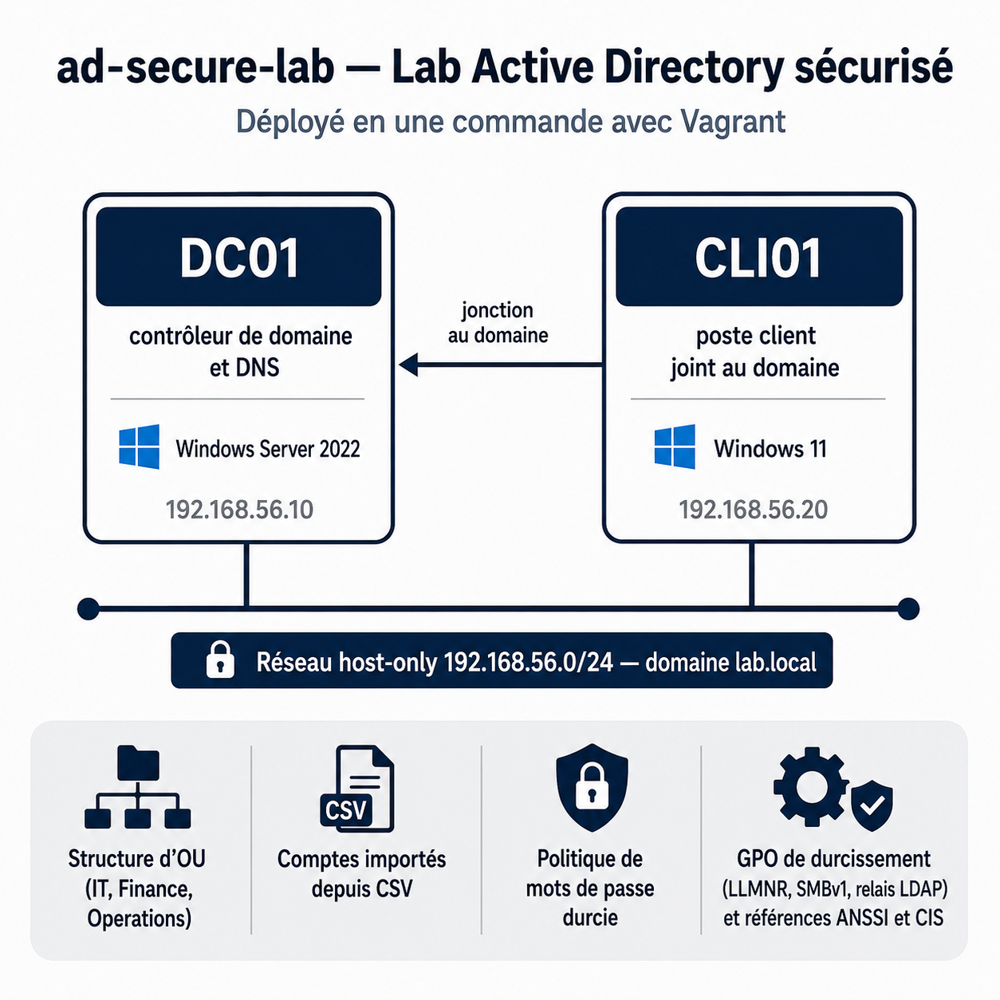

# Lab Active Directory sécurisé



Infrastructure as code pour déployer en une commande un environnement Active Directory durci sur poste local. Le projet provisionne un contrôleur de domaine, un poste client joint au domaine, une structure d'annuaire réaliste et un socle de durcissement appliqué par GPO.

Ce dépôt sert de support de pratique pour l'administration système Windows et la sécurisation d'un annuaire. Il documente les choix techniques et leur justification sécurité, pas seulement le code.

## Aperçu

| Composant | Rôle | Système | Adresse |
|-----------|------|---------|---------|
| DC01 | Contrôleur de domaine, DNS | Windows Server 2022 | 192.168.56.10 |
| CLI01 | Poste client joint au domaine | Windows 11 | 192.168.56.20 |

Domaine : `lab.local`
Réseau host-only : `192.168.56.0/24`

## Ce que le lab met en place automatiquement

- Promotion d'un contrôleur de domaine et configuration DNS
- Structure d'unités d'organisation par fonction (IT, Finance, Operations)
- Groupes de sécurité et comptes utilisateurs importés depuis un fichier CSV
- Politique de mot de passe et de verrouillage durcie
- GPO de durcissement contre des vecteurs d'attaque connus (empoisonnement LLMNR, SMBv1, relais LDAP, énumération anonyme)
- Jonction automatique du poste client au domaine

## Prérequis

| Outil | Version conseillée | Rôle |
|-------|--------------------|------|
| VirtualBox | 7.0 ou supérieure | Hyperviseur |
| Vagrant | 2.4 ou supérieure | Orchestration |
| Plugin vagrant-reload | dernière version | Gestion des redémarrages |
| RAM disponible | 8 Go minimum | Les deux VM tournent en parallèle |

Installation du plugin requis :

```bash
vagrant plugin install vagrant-reload
```

## Démarrage rapide

```bash
git clone https://github.com/Cyber31000/ad-secure-lab.git
cd ad-secure-lab
vagrant up
```

La première exécution télécharge les images Windows, ce qui prend du temps selon la connexion. Le provisioning enchaîne la promotion du contrôleur, sa configuration, le durcissement, puis la jonction du client. Plusieurs redémarrages sont normaux et gérés automatiquement.

## Accès aux machines

```bash
# Ouvrir une session RDP ou WinRM vers le contrôleur
vagrant rdp dc01

# Ouvrir une session vers le client
vagrant rdp cli01
```

Comptes de laboratoire :

| Compte | Mot de passe | Usage |
|--------|--------------|-------|
| LAB\Administrator | vagrant | Administration du domaine |
| LAB\m.lefevre (et autres) | User-L@b-2025! | Comptes utilisateurs, changement imposé à la première connexion |

Ces identifiants sont des valeurs de laboratoire. Voir la note de sécurité en bas de page.

## Cycle de vie

```bash
vagrant halt        # arrêt des VM
vagrant up          # redémarrage
vagrant provision   # rejouer le provisioning (scripts idempotents)
vagrant destroy -f  # suppression complète
```

## Structure du dépôt

```
ad-secure-lab/
├── Vagrantfile              orchestration des deux VM
├── data/
│   └── users.csv            comptes utilisateurs à importer
├── scripts/
│   ├── dc/                  provisioning du contrôleur de domaine
│   │   ├── 01-install-adds.ps1
│   │   ├── 02-configure-ad.ps1
│   │   └── 03-apply-gpo.ps1
│   └── client/
│       └── 01-join-domain.ps1
└── docs/                    documentation technique
    ├── architecture.md      schéma réseau et choix d'infrastructure
    ├── architecture.png     schéma d'architecture du lab (image)
    ├── ou-design.md         logique de la structure d'annuaire
    ├── gpo-hardening.md     justification de chaque mesure de durcissement
    └── troubleshooting.md   pannes courantes et résolution
```

## Documentation

- [Architecture](docs/architecture.md) : topologie réseau, dimensionnement, choix des images
- [Conception de l'annuaire](docs/ou-design.md) : structure d'OU, délégation, ciblage de GPO
- [Durcissement par GPO](docs/gpo-hardening.md) : chaque mesure, le vecteur d'attaque qu'elle contre, la référence ANSSI ou CIS associée
- [Dépannage](docs/troubleshooting.md) : erreurs fréquentes et corrections

## Note de sécurité

Tous les mots de passe de ce dépôt sont des valeurs de laboratoire en clair. Ce projet est conçu pour un environnement isolé sur poste local. Ne jamais réutiliser ces identifiants, ne jamais exposer ces machines sur un réseau de production, ne jamais publier de vrais secrets dans un dépôt Git. En conditions réelles, les secrets se gèrent par coffre dédié et les comptes par délégation et moindre privilège.

## Licence

MIT. Voir le fichier LICENSE.
